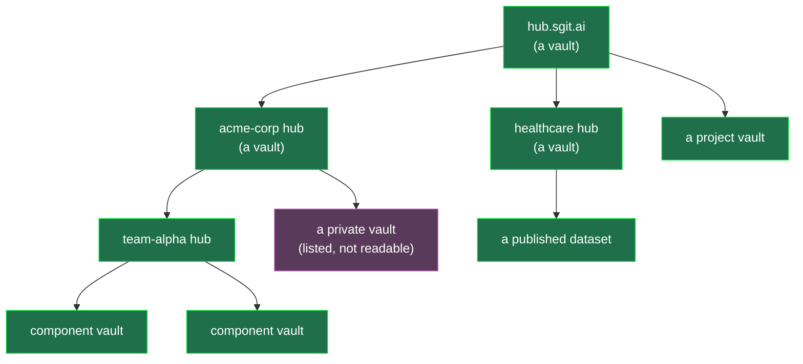

# 01 — The Model, and the Fractal

## 1. The model (settled — do not relitigate)

**A forge whose application layer runs in the browser.** The client holds the vault key or
read key; the server is object storage plus a small interface and reads nothing. Every
feature a conventional forge implements server-side *because the server can read plaintext*
is implemented client-side here *because the client can decrypt*.

The reference class is a **self-hostable forge**, not the largest code host — those users
already accept running a server, and the claim is that the server can be **storage rather
than an application**.

| | Self-hosted forge | Vault forge |
|---|---|---|
| The server is | an application + a database | **object storage + a small interface** |
| The server can read | everything | **nothing** |
| The application runs | on the server | **in the browser** |
| A compromise yields | every repository, in plaintext | ciphertext, and no keys |

**Features follow the key, not the tier.** Anything you hold a key to gets the full
experience, public or private. Only *discovery across vaults you hold no key to* needs a
reading index — and that is possible only for vaults whose owner published the key.

## 2. The fractal: a hub is a vault

This is the addition of 18 Aug, and the useful thing about it is that **it is not a new
mechanism**. It falls out of two things the design already has:

- the catalogue **lives in a vault** (v0.33.58 catalogue brief), and
- **publishing is a folder copy** (v0.33.59 publish brief).

Compose those and a hub is just a vault that happens to contain a catalogue:

```
   A HUB  =  a vault containing:
              cover.json      what this hub is        (plaintext)
              catalogue/      entries: vault_id, read key if public, description
              index.html      the loader              (plaintext)
              …ciphertext…    everything else
```

A catalogue entry points at a vault. **Nothing says the vault it points at cannot itself be
a hub.** So:



**Navigating the network is navigating a graph of vaults**, and every edge is the same
operation the client already performs: resolve a vault id, fetch a ref, decrypt, render.
Federation needs no federation protocol — no server-to-server sync, no shared identity, no
trust between hubs. A hub that lists another hub has *made a link*, nothing more.

This is closer to **GitLab than GitHub** deliberately: many instances, self-hosted, peers
rather than a centre. The difference from GitLab is that an instance here is not a server
at all — it is a published folder — so the marginal cost of a new hub is a bucket and a
`sgit publish`.

### Why the fractal is the adoption strategy

A community cannot adopt a platform it must be granted access to. It can adopt a **format**.

- **A hub costs nothing to run**, so a working group, a conference, a company or one person
  can each have one, and they do not have to agree on anything to interoperate.
- **Hubs are forkable like everything else**: clone a hub vault, rekey, publish — now you
  have your own, seeded with theirs (`rekey = fork`, and forks are cryptographically
  unlinkable, measured).
- **There is no lock-in to argue about**, because the artefact is a folder anyone can copy,
  and the reader is a static page.
- **The top-level hub earns its position by curation**, not by control. If it is wrong, it
  is replaceable by a fork — which is the honest version of a community platform.

### Three things the fractal needs (and only three)

1. **A catalogue schema**, fixed early (`04-catalogue` brief already sketches it), with one
   field that makes the graph traversable: `kind: vault | hub`.
2. **A cover schema**, so an entry can be rendered without a key (already specified in the
   static-publishing pack).
3. **A loop guard.** Hub A can list hub B which lists hub A. The client walks a graph, not a
   tree, so it must carry a visited set and a depth bound. Cheap, and the failure without it
   is a hung browser tab.

Nothing else. No consensus, no registry, no server-side crawl.

## 3. Public and private in the fractal

**Everything on a hub is encrypted, except the vaults an owner deliberately publishes.**
That is a property of each vault, not a property of the hub, which has a consequence worth
stating plainly:

| What the hub holds | Who can read it |
|---|---|
| a private vault's objects | nobody without the key — including the hub operator |
| a private vault's **catalogue entry** | anyone (title, description, "request access") |
| a public vault's objects | anyone, because the owner published the key |
| the hub's own catalogue | anyone |

So a hub can be a **useful index of things it cannot read**. A private vault is *listed,
described, linkable and requestable* — and still opaque. That is the "cover file" pattern
doing real work, and it is what makes a hub valuable to an organisation whose repositories
are overwhelmingly private.

**The exception that must travel with the claim:** the *shape* of the estate is disclosed
regardless — how many vaults, how big, how often they change. The catastrophic-failure
principle is stated with that exception (v0.33.59), and the hub inherits it. A hub is a
public statement that these vaults exist.

## 4. What the fractal does not solve

- **Discovery still needs a reading index**, and only for published-key vaults. A hub-of-
  hubs makes *navigation* fractal; it does not make *search* work across vaults nobody
  published a key for.
- **Trust does not compose.** Hub A listing hub B is not an endorsement, and a user two hops
  out has no basis to trust an entry. Provenance (who listed this, when, and what did they
  verify) is a catalogue field, not an emergent property.
- **Stale pointers are the failure mode.** An intermediary can withhold or serve an old
  ref — it cannot forge content, because content is authenticated, but it can serve *last
  week's*. Freshness is the reader's problem and the loader should surface the head's age.
