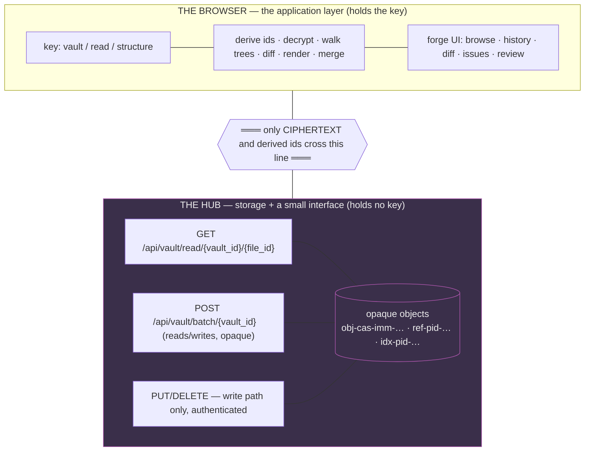
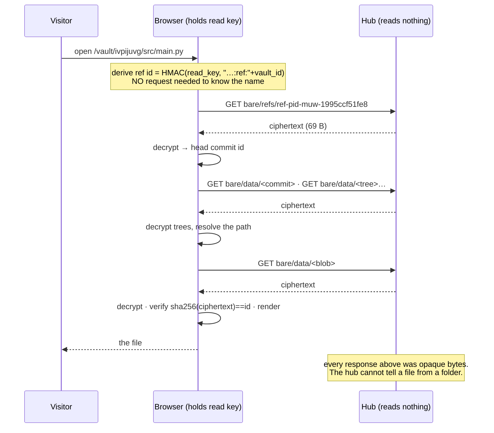

# 03 — Architecture & Flows

## 1. What runs where

The specification asks for one thing above all: *"it should be obvious from the diagram
alone that the server cannot read."*



The server's entire read surface is **one GET of a client-computed name**. It has no notion
of who is asking or what they hold; it cannot distinguish a public vault from a private one,
because the bytes are identical (proven — that is the "one deployment, two link modes"
property). Everything else in a forge — browse, diff, history, merge, review — happens above
the line.

## 2. The data path for one file view — the whole system in miniature



**Two optimisations already shipped, both relevant to a browsing UI:**

- **The per-path index (cache layer)** turns "resolve a known path" from *depth* round trips
  into **one**. For a forge whose hot path is "show me this file", this is the difference
  between a snappy UI and a walk. It exists today.
- **Sparse fetch** means a browsing session fetches the subtree it is viewing, not the
  vault. The honest performance claim is: **this scales with what you look at, not with the
  size of the vault** — provided the interface only fetches what is being viewed. Sparse
  should be the **default** in a forge UI, not an option.

## 3. The fractal walk

```mermaid
sequenceDiagram
  participant B as Browser
  participant H1 as hub.sgit.ai (a vault)
  participant H2 as acme hub (a vault)
  participant V as a project vault

  B->>H1: open hub (read key is public)
  H1-->>B: cover + catalogue
  B->>B: render entries; kind: vault | hub
  B->>H2: follow an entry of kind=hub
  Note over B: SAME operation as opening any vault —<br/>no federation protocol, no server-to-server call
  H2-->>B: cover + catalogue
  B->>V: follow an entry of kind=vault
  V-->>B: the vault, browsable
  Note over B: carry a visited set + depth bound:<br/>the graph may contain cycles
```

Every edge is "open a vault". The hub network is a graph the *client* walks, which is why no
hub needs to trust, or even know about, any other.

## 4. The five user flows the specification asks for

### 4.1 Arriving at a public vault, key in the link

Fragment or `sgit_public_read_*` file → loader classifies → opens. No account, no server
logic. **This is the demonstration** and it is achievable now.

### 4.2 Opening a private vault — the flow needing the most care

The specification is blunt that *"pasting a vault key into a web page is the obvious wrong
answer"*, and it is right — but the considered position it asks for now exists:

```
1. fragment            explicit intent: someone handed you this link
2. stored key          the returning visitor, opt-in only
3. key service         the managed case
4. paste — as a chosen fallback, never the default
```

with two rules the CLI already implements and the loader must mirror:

- **classify by declaration, never by shape** (`classify_key` → `Enum__Key_Kind`);
- **refuse a vault key outright**: a read-only surface must never accept write capability.
  *"That is your vault key, which can modify this vault. A reader only needs your read key."*

And **strip the fragment once read**, and **never store a key without asking**.

### 4.3 Browsing and reading, including a diff

Sparse by default; per-path index for the hot path; both sides of a diff are objects the
client already knows how to fetch. All *surfacing*, no new capability.

### 4.4 Proposing a change without write access

The serialised-diff pattern: work on a clone, emit a reviewable artefact, hand it over. The
proposer needs **no credential on the target vault at all** — which is the inverse of the CI
problem and the reason it is the easy case.

### 4.5 Reviewing and merging

Branch + merge exist client-side today (`CLI__Merge`, conflict handling). The forge surfaces
them; the write is the only step needing the write key.

## 5. Where the hub sits relative to what we already shipped

| Hub need | Substrate | State |
|---|---|---|
| open from a read key | `import_read_key` / `clone_read_only` | shipped |
| read with no server at all | `Vault__API__Static` | spiked, productionising (P1) |
| one-request file reads | cache layer (per-path index) | shipped |
| publish a hub = publish a folder | `sgit publish` | dev pack, P2/P4 |
| serve a hub locally | `sgit vault serve` | dev pack, P3 |
| fork a hub | `sgit vault rekey` | shipped |
| mirror a hub you cannot read | `sgit vault mirror` | dev pack, P5 |
| show shape without content | **structure key** | shipped, no consumer |
| finer-than-vault permissions | sub-vaults | **absent — decide first** |
