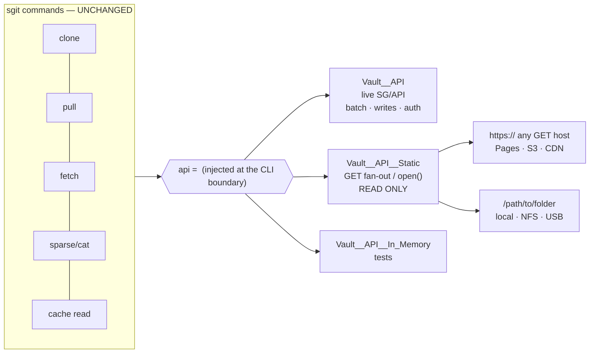
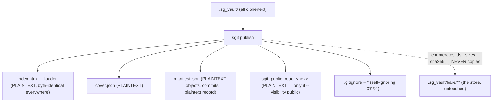

# 01 — Architecture

## 1. The one seam that makes this small



Every action already accepts `api=`, so the static transport is a **sibling class,
injected** — not a mode flag inside `Vault__API` and not a `Vault__Backend` port. Proven:
`scripts/spike__static_vault_transport.py` clones from GitHub Pages, a dumb HTTP server and
a plain folder with **zero changes to any call site**.

### The four methods that carry the entire read path

| Method | Static implementation |
|---|---|
| `batch_read(vault_id, ids)` | bounded parallel GETs (8 HTTP / 1 local); a 404 is an *answer* (`None`), not an error |
| `read(vault_id, id)` | one GET / `open()` |
| `presigned_read_url(...)` | returns the object's **own** URL — `urlopen` handles `file://`, so the existing large-blob path works unmodified |
| `list_files(prefix)` | local: walk. HTTP: read `manifest.json`; else `[]` |
| `write` / `delete` / `batch` | raise `Vault__Read_Only_Transport_Error` |

> `presigned_read_url` is **not** optional. It is on the clone path for every blob over
> ~4 MB (`Vault__Sync__Clone.py:249,336`). A static transport that only reroutes
> `batch_read` clones small vaults fine and then fails on the first large file — a
> size-dependent bug that will not show up in small fixtures.

### Transport resolution (transparent, but never silent)

```
base_url is not http(s)://   ->  local transport      (unambiguous)
base_url is http(s)://       ->  try batch once
                                  ├─ works            -> api transport
                                  └─ 404/405/501/CORS -> static transport (remembered)
on-host layout               ->  sniffed on first read, then sticky
```

Both layouts are tried on the first read and the winner is cached:

```
api/vault/read/{vault_id}/{file_id}     <- canonical published layout
{file_id}                               <- plain directory server / bare folder
```

The resolved transport is **reported** — in command output and `sgit vault info`
(`transport: static-http (GET fan-out, read-only)`) — and can be forced with
`--transport auto|api|static|local`. Visible ≠ silent: that is what keeps auto-detection
from hiding a deployment mistake.

## 2. Publish generates the plaintext surface — and copies nothing

The vault is entirely ciphertext. Publish deliberately **inverts** that for a small, fixed,
declared set of *generated* files. That inversion is the publish step's whole job and its
highest risk — and it is the whole output: the ciphertext is never copied (r9), only
enumerated.



## 3. The published layout — the surface only; the ciphertext is never copied

```
.sg_vault/publish/          <- the only output; there is no target argument (07)
├── index.html                              PLAINTEXT  loader (generated, byte-identical)
├── cover.json                              PLAINTEXT  title/description/image/updated/access/public
├── manifest.json                           PLAINTEXT  REQUIRED — see §4
├── sgit_public_read_<64-hex>               PLAINTEXT  only when --visibility public
├── api/openapi.json                        PLAINTEXT  optional — generated from manifest.json (08)
├── api/docs/                               PLAINTEXT  optional — Swagger UI docs page (08)
├── bundles/                                optional   ZIP_STORED (P6) — never on git targets (10)
└── .gitignore                              containing `*` — self-ignoring (07 §4)
```

**`publish` writes kilobytes, whatever the vault weighs.** It does **not** copy the
ciphertext: the store already exists, complete and correct, at `.sg_vault/bare/**`, one
directory away. An earlier revision projected a byte-copy of the whole store into this
folder under `api/vault/read/<vault_id>/bare/**` — that doubled the on-disk store on every
machine and every checkout, re-copied it on every publish, and bought nothing but a URL
shape the transport sniffs anyway (r9 in `CHANGELOG.md`; the maintainer caught it). The
manifest **enumerates** the store — every file_id, size, `sha256` — it never contains it.

### Where the ciphertext lives at serve time — two compositions, both proven

The served root = **surface + store**, put together by the deployer (or by `serve`):

```
CO-LOCATED (the one-repo pattern — zero copies anywhere)
  served root = the repo itself (.nojekyll on Pages)
  /​.sg_vault/publish/…      the surface, committed as-is
  /​.sg_vault/bare/…          the store, already committed
  loader fetches ../bare/{fid} · CLI clones with base_url …/.sg_vault  (flat layout — VERIFIED)

COMPOSED (clean site root — the deploy step assembles, keyless)
  cp -r .sg_vault/publish/*  <site>/
  cp -r .sg_vault/bare       <site>/api/vault/read/<vault_id>/bare
  loader fetches api/vault/read/<vid>/{fid} · same URLs as the live API  (VERIFIED)
```

`sgit vault serve` performs the composed view **virtually** — it routes
`/api/vault/read/<vid>/bare/*` to `.sg_vault/bare/*` and serves `publish/` at the root — so
nothing is ever copied on the author's machine either.

**Why the `api/vault/read/<vault_id>/…` prefix remains canonical for composed deploys:** the
same URL then works against the live API *and* the static host. Discovery is unchanged in
kind: the transport already sniffs `api/vault/read/{vid}/{fid}` and `{fid}`; the loader
tries `api/vault/read/<vid>/` then `../bare/` relative to itself.

The two `api/` entries are optional and described in
[`08__api-docs.md`](08__api-docs.md); when emitted they join the **declared plaintext
surface** in `manifest.json` like everything else.

**Why the key lives in a filename** (public vaults only): it keeps the loader **identical
across every vault** — one file, cacheable and verifiable once — because the per-vault part
is a separate object whose *name* is the key. The loader's discovery rule reduces to a glob:
`sgit_public_read_*`. A filename appears in access and CDN logs, which is irrelevant for a
key that is already public and **wrong** for one that is not; the private path uses the URL
fragment instead, and this convention must never be carried across by analogy.

## 4. `manifest.json` — required, three jobs

```jsonc
{
  "schema": "sgit_published_v1",
  "vault_id": "ivpijuvg",
  "generated_by": "sgit v0.15.6",
  "layout": "api-path",                    // or "flat"
  "visibility": "public",                  // bare | named | public
  "head": "obj-cas-imm-…head",
  "plaintext_surface": [                   // JOB 3 — auditable: EVERY non-ciphertext file
    {"path": "index.html",    "sha256": "…"},
    {"path": "cover.json",    "sha256": "…"},
    {"path": "manifest.json", "sha256": null},
    {"path": ".gitignore",    "sha256": "…"},
    {"path": "sgit_public_read_c28b…", "sha256": "…"}
  ],
  "objects": [                             // JOB 1 — custody. sha256 = hash of the ciphertext,
    {"file_id": "bare/refs/ref-pid-muw-1995ccf51fe8",  "size": 69,   "sha256": "…"},
    {"file_id": "bare/indexes/idx-pid-muw-dd6887115f9d","size": 214,  "sha256": "…"},
    {"file_id": "bare/keys/key-rnd-imm-7239f4aa88819106","size": 1032,"sha256": "…"},
    {"file_id": "bare/data/obj-cas-imm-…",             "size": 8871, "sha256": "…"}
  ],
  "commits": ["obj-cas-imm-…head", "obj-cas-imm-…parent"]   // JOB 2 — parallel fetch
}
```

1. **Custody.** Every filename in a vault is `HMAC(read_key, …)` or a content hash learned
   by decrypting a tree. Without the manifest a keyless client **cannot name a single
   file**, so invariant 3 is unsatisfiable. This is the reason it is mandatory. The
   per-object `sha256` (added 19 Aug) lets a keyless mirror verify **every** file: only
   `obj-cas-imm-*` names are self-verifying, and the executed tabletop could
   content-verify just 12 of 18 objects without it (`10`, step 7).
2. **Parallel bundle fetch.** Without an ordered commit list, per-commit bundles must be
   fetched *serially* — you cannot know commit N−1's id before decrypting commit N — which
   would make bundles slower than the loose objects they replace.
3. **Auditability.** The plaintext surface is declared and hashed, so "nothing else is
   exposed" is verifiable by inspection rather than trusted.

It is a **hint, never authority**: a client that distrusts it falls back to the parent walk
over loose objects.

## 5. The plaintext-surface rule

**Fixed names in code. Never patterns, never a folder emitted wholesale.** If the surface
were decided by matching vault content, anyone who can write to the vault — a collaborator, a
compromised agent — could move a file into the plaintext surface by naming it. An explicit
allow-list cannot be widened from inside the vault's content: a vault may *replace*
`index.html`, it can never *add* `secrets.txt`.

**The loader emitted by `publish` is always sgit's bundled template.** A vault may also
contain its own root `index.html`, but at publish time that file is **ciphertext like
everything else**, so it cannot influence the output — invariant 4 is true by construction, and
`.sg_vault/publish/` holds no vault content at all.

The two files meet only at **deployment**, and only when the deployer holds the key and expands
plaintext. There the vault's own page takes precedence and simply replaces the loader — in a
fully expanded deployment every file is already plaintext, so there is nothing left for a
loader to do (`07` §3).

> **The allow-list decides what `publish` may emit as plaintext. Expansion is a separate,
> key-holding, deployment-time act.**

## 6. Key discovery in the loader


The CLI already ships this classifier — `Vault__Crypto.classify_key()` → `Enum__Key_Kind`
(commit `67c2ab6`) — so the loader **ports** it rather than reinventing it. Classification
is by *declaration*, never by shape; guessing from shape is what once misrouted a 64-hex
passphrase to a read-only clone.
