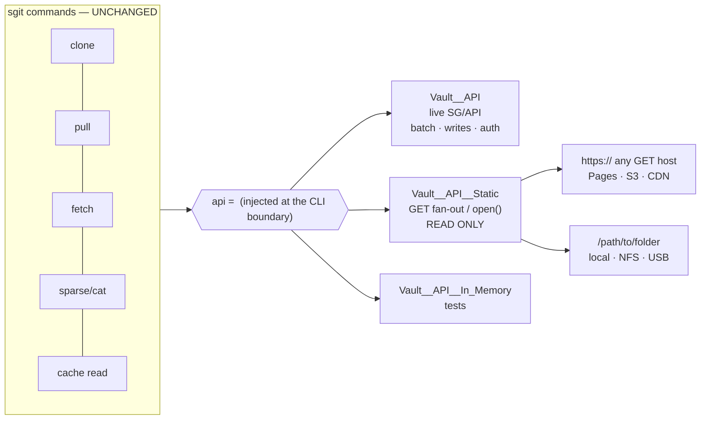
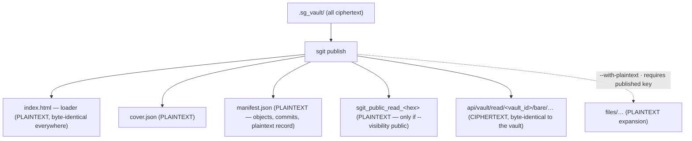
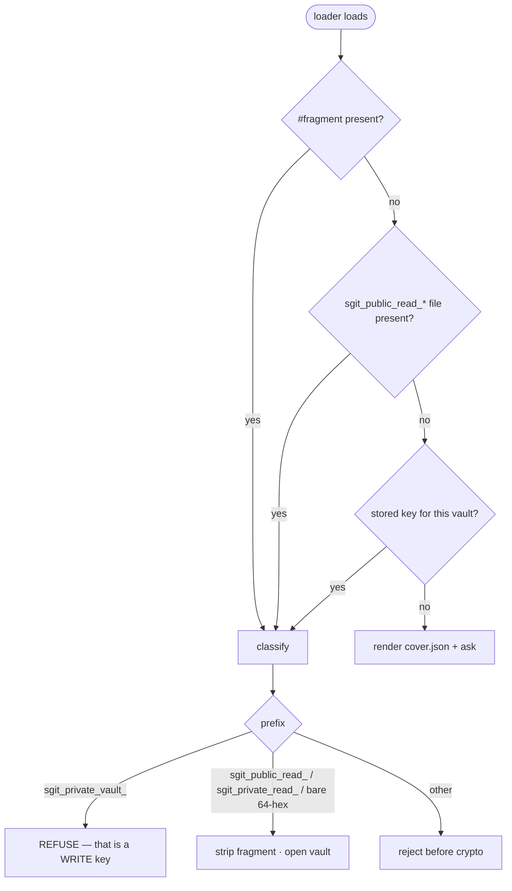

# 01 — Architecture

## 1. The one seam that makes this small



Every action already accepts `api=`, so the static transport is a **sibling class,
injected** — not a mode flag inside `Vault__API` and not a `Vault__Backend` port. Proven:
`scripts/spike__static_vault_transport.py` clones from GitHub Pages, a dumb HTTP server and
a plain folder with **zero changes to any call site**.

### The four methods that carry the entire read path

| Method | Static implementation |
|---|---|
| `batch_read(vault_id, ids)` | bounded parallel GETs (8 HTTP / 1 local); a 404 is an *answer* (`None`), not an error |
| `read(vault_id, id)` | one GET / `open()` |
| `presigned_read_url(...)` | returns the object's **own** URL — `urlopen` handles `file://`, so the existing large-blob path works unmodified |
| `list_files(prefix)` | local: walk. HTTP: read `manifest.json`; else `[]` |
| `write` / `delete` / `batch` | raise `Vault__Read_Only_Transport_Error` |

> `presigned_read_url` is **not** optional. It is on the clone path for every blob over
> ~4 MB (`Vault__Sync__Clone.py:249,336`). A static transport that only reroutes
> `batch_read` clones small vaults fine and then fails on the first large file — a
> size-dependent bug that will not show up in small fixtures.

### Transport resolution (transparent, but never silent)

```
base_url is not http(s)://   ->  local transport      (unambiguous)
base_url is http(s)://       ->  try batch once
                                  ├─ works            -> api transport
                                  └─ 404/405/501/CORS -> static transport (remembered)
on-host layout               ->  sniffed on first read, then sticky
```

Both layouts are tried on the first read and the winner is cached:

```
api/vault/read/{vault_id}/{file_id}     <- canonical published layout
{file_id}                               <- plain directory server / bare folder
```

The resolved transport is **reported** — in command output and `sgit vault info`
(`transport: static-http (GET fan-out, read-only)`) — and can be forced with
`--transport auto|api|static|local`. Visible ≠ silent: that is what keeps auto-detection
from hiding a deployment mistake.

## 2. Publish is a projection, not a copy

The vault is entirely ciphertext. The published output deliberately **inverts** that for a
small, fixed, declared set of files. That inversion is the publish step's whole job and its
highest risk.



## 3. The published layout

```
<output>/
├── index.html                              PLAINTEXT  loader (generated, byte-identical)
├── cover.json                              PLAINTEXT  title/description/image/updated/access/public
├── manifest.json                           PLAINTEXT  REQUIRED — see §4
├── sgit_public_read_<64-hex>               PLAINTEXT  only when --visibility public
├── api/vault/read/<vault_id>/bare/
│   ├── refs/ref-pid-muw-…                  CIPHERTEXT mutable — short cache TTL
│   ├── indexes/… keys/… data/…             CIPHERTEXT immutable — cache forever
│   └── cache/…                             CIPHERTEXT optional; 1-batch hot reads
├── bundles/head-<commit>.zip               optional   head snapshot (ZIP_STORED)
├── bundles/<commit>.zip                    optional   per-commit delta
└── files/…                                 PLAINTEXT  only with --with-plaintext + published key
```

**Why the `api/vault/read/<vault_id>/…` prefix:** the same URL then works against the live
API *and* the static projection, which is the stated goal of the whole exercise. The flat
layout still clones (we sniff it), but the canonical emit is the API layout.

**Why the key lives in a filename** (public vaults only): it keeps the loader **identical
across every vault** — one file, cacheable and verifiable once — because the per-vault part
is a separate object whose *name* is the key. The loader's discovery rule reduces to a glob:
`sgit_public_read_*`. A filename appears in access and CDN logs, which is irrelevant for a
key that is already public and **wrong** for one that is not; the private path uses the URL
fragment instead, and this convention must never be carried across by analogy.

## 4. `manifest.json` — required, three jobs

```jsonc
{
  "schema": "sgit_published_v1",
  "vault_id": "ivpijuvg",
  "generated_by": "sgit v0.15.6",
  "layout": "api-path",                    // or "flat"
  "visibility": "public",                  // bare | named | public
  "head": "obj-cas-imm-…head",
  "plaintext_surface": [                   // JOB 3 — auditable
    {"path": "index.html",    "sha256": "…"},
    {"path": "cover.json",    "sha256": "…"},
    {"path": "manifest.json", "sha256": null},
    {"path": "sgit_public_read_c28b…", "sha256": "…"}
  ],
  "objects": [                             // JOB 1 — custody
    {"file_id": "bare/refs/ref-pid-muw-1995ccf51fe8", "size": 69},
    {"file_id": "bare/data/obj-cas-imm-…",            "size": 8871}
  ],
  "commits": ["obj-cas-imm-…head", "obj-cas-imm-…parent"]   // JOB 2 — parallel fetch
}
```

1. **Custody.** Every filename in a vault is `HMAC(read_key, …)` or a content hash learned
   by decrypting a tree. Without the manifest a keyless client **cannot name a single
   file**, so invariant 3 is unsatisfiable. This is the reason it is mandatory.
2. **Parallel bundle fetch.** Without an ordered commit list, per-commit bundles must be
   fetched *serially* — you cannot know commit N−1's id before decrypting commit N — which
   would make bundles slower than the loose objects they replace.
3. **Auditability.** The plaintext surface is declared and hashed, so "nothing else is
   exposed" is verifiable by inspection rather than trusted.

It is a **hint, never authority**: a client that distrusts it falls back to the parent walk
over loose objects.

## 5. The plaintext-surface rule

**Fixed names in code. Never patterns.** If the surface were decided by matching vault
content, anyone who can write to the vault — a collaborator, a compromised agent — could
move a file into the plaintext surface by naming it. An explicit allow-list cannot be
manipulated from inside the vault's content.

**The loader is always sgit's bundled template.** If the vault also contains a loader file,
it is ordinary content: encrypted, and expanded only with a key. This makes invariant 4
(byte-identical loader) true *by construction* rather than by discipline, and keeps
"generated rather than hand-edited" honest. `sgit vault loader --install` may commit a copy
into the vault so it travels with folder copies, but **publish never trusts it**.

## 6. Key discovery in the loader



The CLI already ships this classifier — `Vault__Crypto.classify_key()` → `Enum__Key_Kind`
(commit `67c2ab6`) — so the loader **ports** it rather than reinventing it. Classification
is by *declaration*, never by shape; guessing from shape is what once misrouted a 64-hex
passphrase to a read-only clone.
