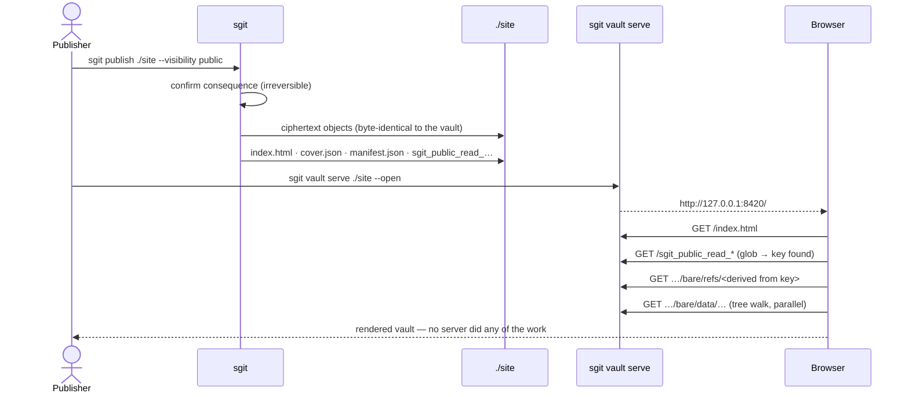
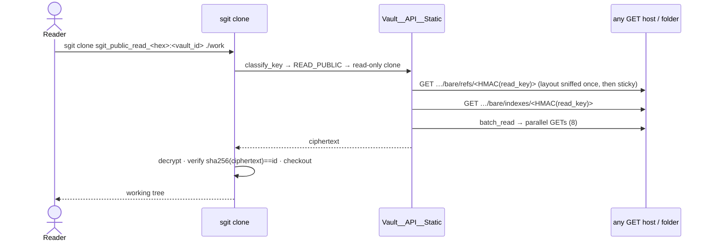
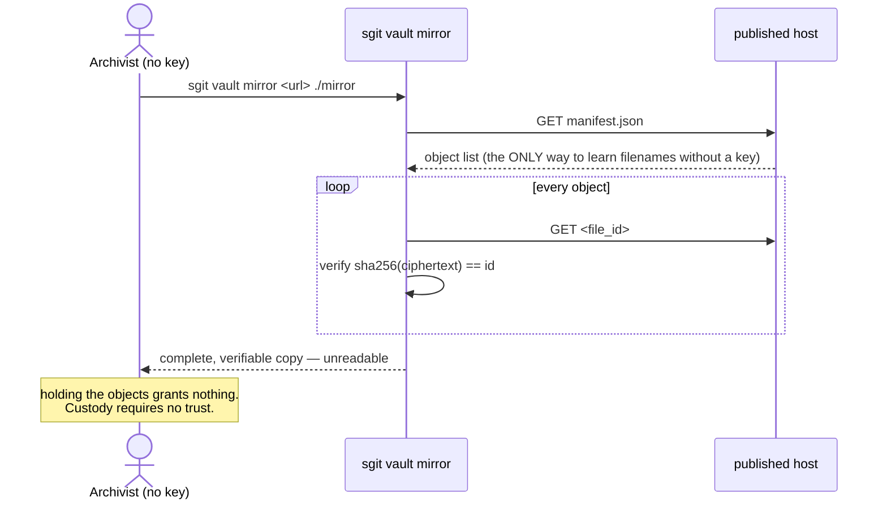
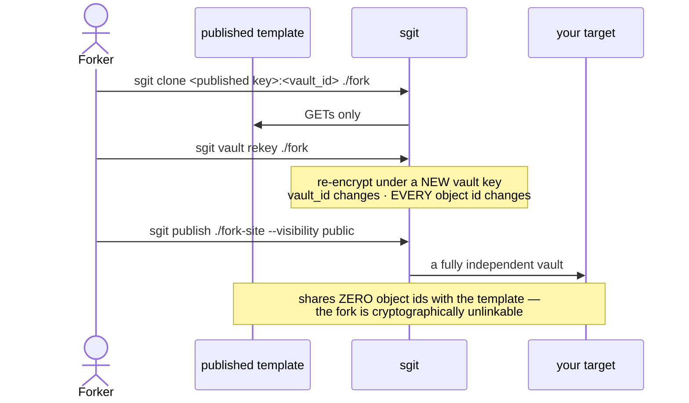
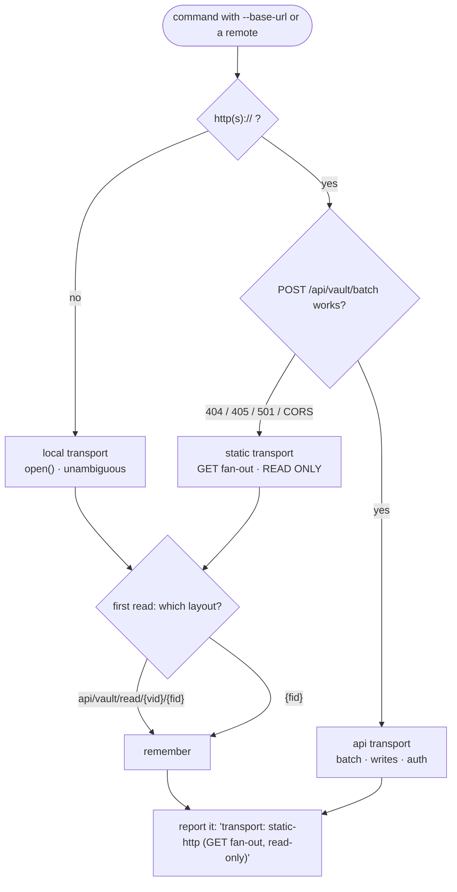

# 03 — Flows

## 1. Publish → serve → read (the baseline, test cell 1)

## 2. Static clone (proven working today)

Verified end to end against `https://sgit-ai.github.io/SGit-AI__API/` — GitHub Pages, no
server, no auth, read key only.

## 3. Custody without access (test cell 11)

Without a manifest **and** without a host listing this flow cannot start: no filename is
derivable without the read key. That is why the manifest is mandatory rather than an
optimisation.

## 4. Fork = clone + rekey + republish (test cell 14, the acceptance test)

**Measured facts this flow must document:**

- A rekey changes the vault_id and **100% of object ids** (0 of 8 preserved), so a fork is a
  new deployment, not a delta — do not expect delta-publishing a fork.
- Forks share **no** identifiers with their template, so derivation is undetectable. The
  corollary is a real loss: **template-diffing by identifier is impossible**, and a fork
  that wants to show its delta must diff plaintext, which needs both read keys.

## 5. Transport resolution (what happens on every command)

Auto-detected so it works transparently against anything; **reported** so a deployment
mistake is visible rather than silent. `--transport auto|api|static|local` forces it.
