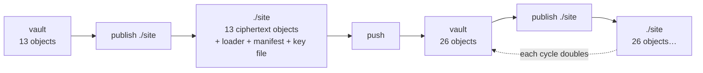

# 07 — Where a published folder may live

**Added:** 2026-08-18, from the maintainer's observation — *"`sgit publish ./site`: I don't
think this should be allowed (making the target folder be inside the vault dir), since all
those files would be marked to be added to the sgit vault."*

**Correct, and it is worse than noise — it is an amplification loop.** Every mockup in `02`
used `./site`, which is exactly the shape that breaks. This file defines the rule, and it is
a **P2 blocker**: the check must exist before the first byte is written, not after.

---

## 1. What actually happens today

`sgit push` walks the work tree and skips only what `Vault__Ignore` says to skip —
`.sg_vault`, `.git`, `node_modules`, the `.env*` secret globs, and whatever `.gitignore`
declares (`Vault__Sync__Push.py:765-773`). A folder called `site/` is none of those, so it
is ordinary content.



Four distinct failures, in descending order of how much they cost:

| # | Failure | Why it is bad |
|---|---|---|
| 1 | **Amplification** | published ciphertext becomes vault content, is re-encrypted, and is included in the next publish. Each publish→push cycle roughly **doubles** the store. Nothing errors; the vault just grows geometrically |
| 2 | **`--force` on an ancestor** | if the target is a *parent* of the work tree, a `--force` that clears the output directory **deletes `.sg_vault`**. Containment must be refused in **both** directions |
| 3 | **Key material becomes content** | `sgit_public_read_<hex>` gets tracked, committed, and travels with the vault into forks and clones. The house rule is that key material is never a plaintext file on disk *inside a vault* — this makes it one, by accident |
| 4 | **Branch switch eats the output** | `Vault__Branch_Switch` restores tracked files; switching branches deletes or staleness-swaps the folder you are serving |

Failure 1 is the one that matters most, because it is **silent**. It is the same shape as
every bug this project has hunted all session: no error, no warning, a correct-looking
result, and a wrong state that compounds.

## 2. The rule

Checked at the CLI boundary, on `os.path.realpath` of both paths (symlinks resolved), and
**before anything is written**:

```
target ⟂ work tree (no containment either way)   -> publish
target is inside .sg_vault/publish/…             -> publish        (the default; always ignored)
target is inside .sg_vault/bare/…                -> REFUSE         (that is the store)
target is inside the work tree, and the vault's
      own ignore rules already ignore it         -> publish + one-line note
target is inside the work tree, not ignored      -> REFUSE
target is an ANCESTOR of the work tree           -> REFUSE         (see failure 2)
```

Two properties make this rule cheap:

- **It invents no new hidden state.** `.sg_vault` is already in `ALWAYS_IGNORED_DIRS`, in
  every shipped version, honoured by push, diff, merge, revert, stash and branch-switch.
- **The escape hatch is user-declared, not magic.** "Already ignored" is evaluated with the
  existing `Vault__Ignore.should_ignore_dir()`. Someone who genuinely wants `./docs`
  published in place adds `docs/` to `.gitignore` and it works — because *they* said so, in
  a file that is visible and versioned.

Reuse `sgit_ai/storage/Vault__Path_Guard.py` for the containment test; it already handles
the traversal and symlink cases and has the payload corpus behind it.

## 3. Why not a new ignored name (`.site`)

The maintainer already flagged the clash risk. There is a second, sharper reason:

**Adding a name to `ALWAYS_IGNORED_DIRS` retroactively changes tracking for every existing
vault.** A user who today has a tracked `.site/` directory would find it silently dropped
from their next push — content disappearing from a vault, caused by upgrading the CLI, with
no message. That is a data-loss-shaped change applied to vaults we do not control, to buy
convenience we can get for free from a directory that is *already* ignored everywhere.

An implicit ignore rule is also the exact anti-pattern this pack keeps legislating against:
a silent behaviour change inside a permissive layer.

## 4. `.sg_vault/publish/` as the default

`sgit publish` with **no argument** publishes to `.sg_vault/publish/`.

| Property | Status |
|---|---|
| Ignored by push/diff/merge/revert/stash/branch-switch | **already true** — `ALWAYS_IGNORED_DIRS` |
| Precedent in the CLI | **`sgit vault backup` already defaults to `.sg_vault/backups/`** (`CLI__Main.py:433`) |
| Swept into backup zips? | **No** — `Vault__Backup` zips `bare/` plus three named `local/` files only (verified: `Vault__Backup.py:115-131`) |
| Removed by `sgit vault wipe --local` | Yes — and that is correct: it is derived output |

**The one thing it is not good for: committing to a Pages repo.** People routinely put
`.sg_vault` in `.gitignore`, so the default output would be un-committable — and "commit
this folder and serve it from Pages" is a primary use case. That case takes an explicit
target *outside* the work tree (`sgit publish ../my-site/docs`), which is the ordinary
arrangement anyway: the vault work tree and the publishing repo are different repos.

So the default is for **local preview and `serve`**; publishing for real names a target.

## 5. The messages

Refusal — names all three fixes, and writes nothing:

```console
$ sgit publish ./site
error: ./site is inside this vault's work tree.

  Published files would be picked up by the next `sgit push` and added to the
  vault, which then republishes them — the vault grows on every cycle. The
  published read key would also become tracked vault content.

  Either:  sgit publish                       (defaults to .sg_vault/publish/ — ignored, for local preview)
  Or:      sgit publish ../my-site/docs       (a target outside this work tree)
  Or:      echo 'site/' >> .gitignore         (declare it ignored, then publish ./site works)
```

Ancestor refusal — a different message, because the risk is different:

```console
$ sgit publish .. --force
error: .. contains this vault's work tree.
  --force clears the output directory, which would delete .sg_vault and every
  file in this vault. Refusing.
```

The allowed-because-declared path says so once, so it never looks accidental:

```console
$ sgit publish ./docs
  note: ./docs is inside the work tree but ignored by .gitignore ('docs/'),
        so publishing here will not add it to the vault.
```

The default:

```console
$ sgit publish
Publishing vault q7r6d5zd → .sg_vault/publish/
  ...
  note: this folder is inside .sg_vault, so it is never added to the vault —
        and it is removed by `sgit vault wipe --local`. For a folder you will
        commit or upload, give a target outside the work tree.
```

## 6. Acceptance criteria (P2)

- [ ] Target inside the work tree and not ignored → **exits non-zero and writes nothing**
      (assert the target does not exist afterwards).
- [ ] Target that is an **ancestor** of the work tree → refused, including with `--force`.
- [ ] Target inside `.sg_vault/bare/…` → refused.
- [ ] Target inside the work tree but matched by `Vault__Ignore` → allowed, prints the note.
- [ ] Containment is computed on **`realpath`** — a symlink inside the work tree pointing
      out (and one outside pointing in) is classified by where it really lands.
- [ ] No argument → `.sg_vault/publish/`, and a subsequent `sgit push` adds **zero** files
      (the regression test for failure 1: publish → push → assert object count unchanged).
- [ ] `ALWAYS_IGNORED_DIRS` is **unchanged** by this feature — assert the set literally, so
      a future "just add `.site`" is a failing test rather than a review comment.

## 7. Knock-on: `sgit vault serve` with no argument

`02` had it publishing to `/tmp/sgit-serve-<vault_id>`. Prefer `.sg_vault/publish/`: same
ignore guarantee, but inspectable, reusable between runs, and cleaned up by the command that
already cleans vault state. Keep `--ephemeral` for a temp dir if a throwaway is wanted.
